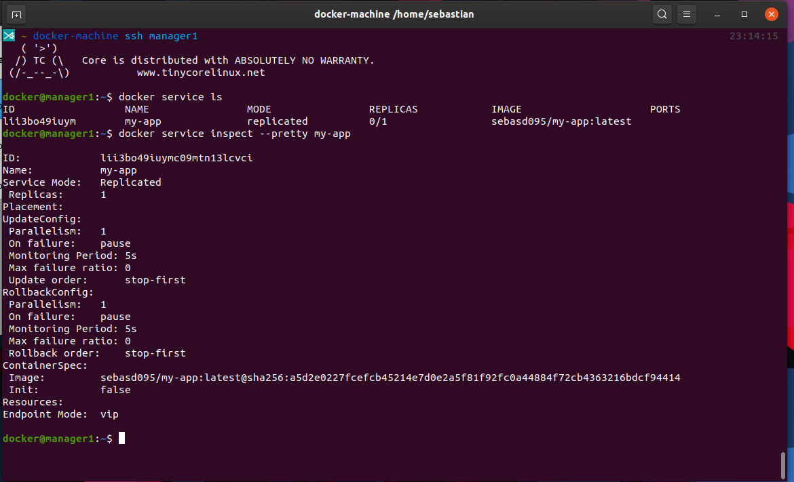

# Docker Swarm Example

Pequeño ejemplo de como hacer un clúster de contenedores en máquinas virtuales (en este caso con virtualbox)

## Dependencias

- [Docker](https://www.docker.com/get-started)
- [Docker Machine](https://docs.docker.com/machine/install-machine/)
- [VirtualBox](https://www.virtualbox.org/wiki/Downloads)

## Instrucciones

1. Primero se necesitará contar con una imagen (puede ser cualquier imagen de docker como por ejemplo una de redis, nginx, etc), para este caso se usará una imagen que tiene un pequeño "hola mundo" desarrollado en express, dicha imagen para este ejemplo se llamará "my-app", para manejar la imagen en las máquinas virtuales se tendrá alojada la imagen en [Dockerhub](https://hub.docker.com/) como [sebasd095/my-app](https://hub.docker.com/r/sebasd095/my-app).
2. Se creará las máquinas virtual en virtualbox a través de dockermachine, para este ejemplo se crearán 3 máquinaas virtuales (1 como nodo manager, 2 como nodos workers):
   #### Manager:
   
   ### Workers:
   
3. Verificamos con el comando ls en docker machine que estén corriendo nuestros nodos:
   
4. Ingresamos al nodo manager con el comando ssh en docker machine:
   
5. Inicializamos docker swarm en el nodo manager con el comando init --advertise-addr indicandole la ip del nodo manager asi:
   
6. Con la inicialización anterior se mostrará un comando con el cuál podemos añadir más nodos a swarm, procedemos a ingresar a los demás nodos y pegar y ejecutar dicho comando:
   
   
7. Verificamos los nodos que tenemos en el clúster:
   
8. Ingresaremos al nodo manager y procederemos a crear un servicio con la imagen (sebasd095/my-app) le daremos como nombre al servicio de my-app y le indicamos que queremos solo una réplica:
   
9. Una vez creado el servicio podemos ver los servicios (en el nodo manager) listados con el comando docker service ls o podemos utilizar el comando inspect para ver con más detalle la información de un servicio en específico:
   
10. En docker service se pueden ejecutar diversos comandos como:
   
11. Podemos realizar actualizaciones de los servicios con el comando update, en este caso vamos exponer el puerto 3000 para el servicio de my-app y verificaremos con el comando ls que dichos cambios se hayan hecho:
   
12. Verificaremos las ip de nuestras máquinas con el comando ls en docker machine (realizar comando fuera de los nodos) y accederemos con el puerto 3000 (asignado en el paso anterior) con cada una de la ip en nuestro navegador, veremos que tendremos acceso al servicio sin importar desde cual nodo accedamos:
   
13. Adicionalmente podemos ver que hay más comandos disponibles del docker service update (desde el manager)
   
14. Podremos actualizar por ejemplo el número de replicas del servicio (desde el manager):

   ```bash
   docker service update --replicas 3 my-app
   ```

15. Luego podremos verificar esto con el comando ps en docker service:
   

De igual modo podremos crear muchos más servicios con las configuraciones que requieran.
